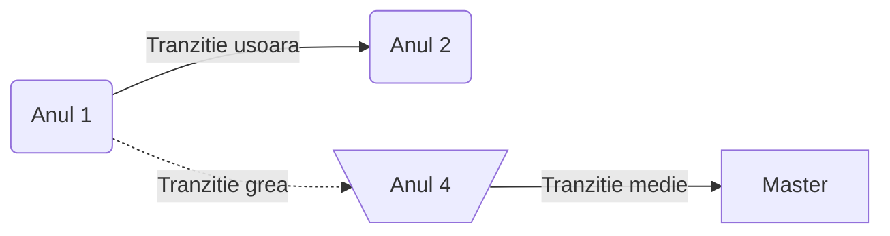

<script id="MathJax-script" async src="https://cdn.jsdelivr.net/npm/mathjax@3.0.1/es5/tex-mml-chtml.js"></script>


[Homepage](index.md)

# Diagrame de tip _Flowchart_

```
```mmermaid
flowchart LR
A(Anul 1) -->|Tranzitie usoara| B(Anul 2)
A -.->|Tranzitie grea| C[\Anul 4/]
C -->|Tranzitie medie| D[Master]
```




**De retinut**
- Diagramele _flowchart_ au noduri si conectori
- Nodurile au:
   - **forma** (data de parantezele folosite la descrierea _nodului_
   - ID (sirul folositbin afara descrierii nodului)
   - Descriere (textul ce apare in caseta nodului si care este implementat in interiorul diferitelor tipuri de paranteze - ce decid forma casetei nodului)
 
- Conectorii au:
   - Diferite tipuri de sageti sau chiar pot activa fara sageti
   - diferite tipuri de linii
      - "-->" linie continua (spre dreapta)
      - "--" linie continua (fara sageti)
      - "<--> linie continua (sageata stanga si dreapta)
      - "==>" linie ingrosata cu sageata spre dreapta
    
# Diagrame Flowchart avansate

```mermaid
flowchart L
A & B --> C & D & E --> F & G 
```

# Diagrama de tip _Timeline_

timeline
title "My Timeline"
section "Section 1"

2023-2024
         : am luat la facultate
         : am luat contact cu mediul academic
2024-2025
         : am terminat anul 1
         : am facut practica 
         
section "Section 2"

2025-2026
        : am facut practica la fotogrametrie

2026-2027
        : anul terminal 4 : am terminat facultatea


